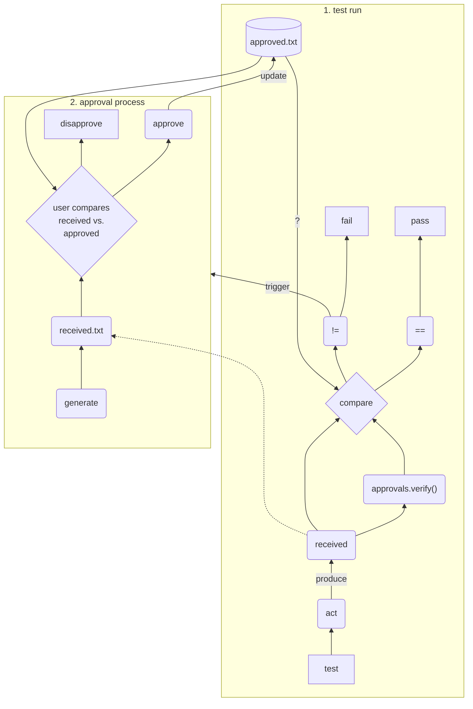

```mermaid
flowchart BT
    subgraph 1. test run
        direction RL
        t[test]
        v("approvals.verify()")
        act(act)
        r(received)
        a[(approved.txt)]
        e(==)
        ne(!=)
        c{compare}
        t-->act
        act--produce-->r
        r-->v
        r-->c
        v-->c
        a--?-->c
        c-->e-->p[pass]
        c-->ne-->f[fail]
    end
    subgraph ap [2. approval process]
        direction BT
        d{user compares\nreceived vs.\napproved}
        g(generate)-->rf(received.txt)-->d
        r-.->rf
        d-->as(approve)
        d-->da[disapprove]
    end
    a-->d
    ne--trigger-->ap
    as--update-->a
```
