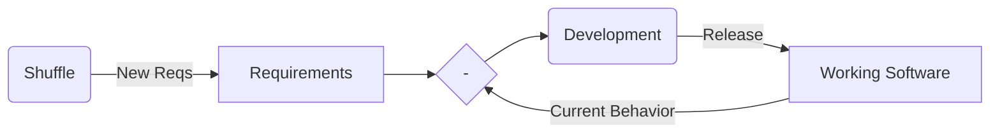

# The Requirements Shuffle Meta-Kata

Practice changing requirements.

# Explanation

Given a bank of potential requirement segments, randomly sample a new requirement in a repeating cadence to be added to the requirements document.

-   Requirements segments may be vague, and even contradicting
-   New requirements are always more important than older requirements (and more urgent of course)
-   Although, our legacy should be maintained
-   Keep it simple



# Things to Practice

-   TDD
-   small steps
-   domain language
-   First make the change easy (warning, this might be hard), then make the easy change.
-   Feature Toggles

# Example - FizzBuzz

FizzBuzz requirements bank - [fizzbuzz.bank](./fizzbuzz.bank)

## Example - add a new random requirement segment

```shell
./shuffle.ts -r fizzbuzz.reqs -b fizzbuzz.bank
```

## Example - shuffle again in 5 min

```shell
sleep 5m && ./shuffle.ts -r fizzbuzz.reqs -b fizzbuzz.bank && code fizzbuzz.reqs &
```

# Flavors / Variants

-   Have a LLM generate the next top priority requirement
-   Points system -
