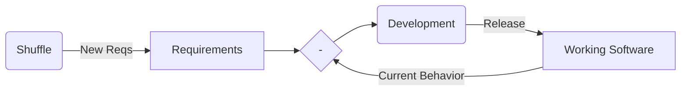
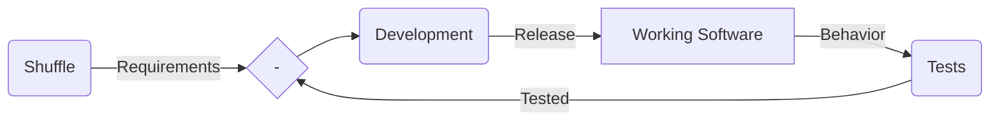

# Requirements Shuffle Meta-Kata

Practice changing requirements.

# Description

Given a bank of potential requirement segments, randomly sample a new requirement in a repeating cadence to be added to the requirements document.

-   Requirements segments may be vague, and even contradicting
-   New requirements are always more important than older requirements (and more urgent of course)
-   Although, our legacy should be maintained

It's a [control problem](https://commons.wikimedia.org/wiki/File:Feedback_loop_with_descriptions.svg#/media/File:Feedback_loop_with_descriptions.svg), where the development effort is attempting to track a moving target - the ever changing requirements. The feedback signal is the gap between the current system's behavior and the current requirements.



Formalizing further, we "sense" the current behavior by using (automated) tests.



# Things to Practice

## Mindset 😌

-   Mindfulness
-   [Embrace Change](https://www.oreilly.com/library/view/extreme-programming-explained/0201616416/)

## Technical 🔧

-   TDD
-   Small things - steps, commits, code entities, iterations
-   Refactoring
-   Domain Language
-   [First make the change easy (warning, this might be hard), then make the easy change.](https://twitter.com/KentBeck/status/250733358307500032?s=20)
-   Release vs Deploy, Feature Toggles
-   More?

# Example - FizzBuzz

FizzBuzz requirements bank - [fizzbuzz.bank](./fizzbuzz.bank)

## Example - add a new random requirement segment

```shell
./shuffle.ts -r fizzbuzz.reqs -b fizzbuzz.bank
```

## Example - shuffle again in 10 min

```shell
sleep 10m && ./shuffle.ts -r fizzbuzz.reqs -b fizzbuzz.bank && code fizzbuzz.reqs &
```

# Flavors / Variants

-   Have a LLM generate the next top priority requirement
-   Points system - +1pt. on requirement met, -1pt. on requirement not met yet, -5pt. on found bug
-   Start with a random set of requirements vs. start with a designed starting position
-   Cadence - change the req every 5 minutes vs. every 30 minutes
