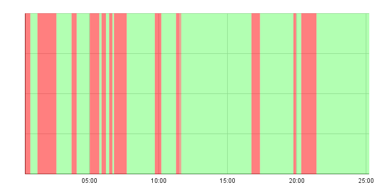

# Shortest Longest Red

Inspired by https://www.industriallogic.com/blog/shortest-longest-red/

Measure how much time is spent in red vs in green.

Try to minimize the time spent in the red.

In this exercise, I tried **automating the the timekeeper**.

## Idea

```sh
./start
ls * | entr sh -c "./test && ./green || ./red"
./report
```

[`entr`](https://github.com/eradman/entr) is a file watcher.

## Implementation Details

- Use [`jaq`](https://github.com/01mf02/jaq) to manipulate a json file logging the events: `green` / `red`
- Export the json to csv and plot using Google Sheets
- Use `jaq` for the kata too, implementing [fizzbuzz](https://sammancoaching.org/kata_descriptions/fizzbuzz.html)
- [ApprovalTests cli](https://github.com/approvals/ApprovalTests.Python#example-using-cli) as the testing mechanism

## Results

**total kata time:** 25:14

**total time in red:** 6:59

**total time in green:** 17:54

**longest time in red:** 1:22



## Learnings and Thoughts

[see here](./thoughts.md)
